# SmartACEers Message Flow Proofchecker - Architecture

## System Architecture Overview

This document provides detailed architectural diagrams and design decisions for the ACE Toolkit Message Flow Proofchecker.

## High-Level Architecture

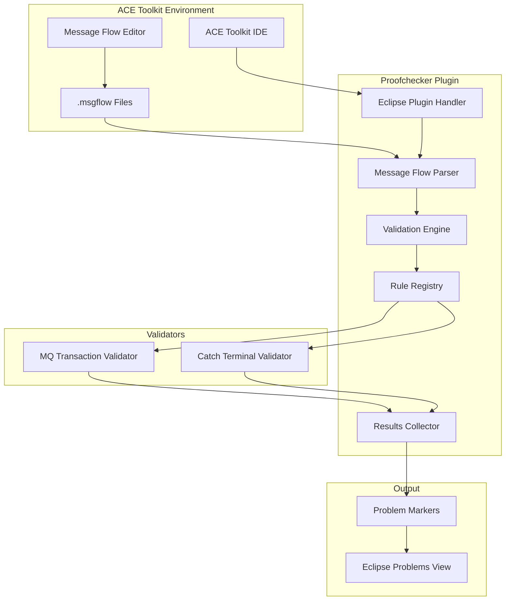

## Component Architecture

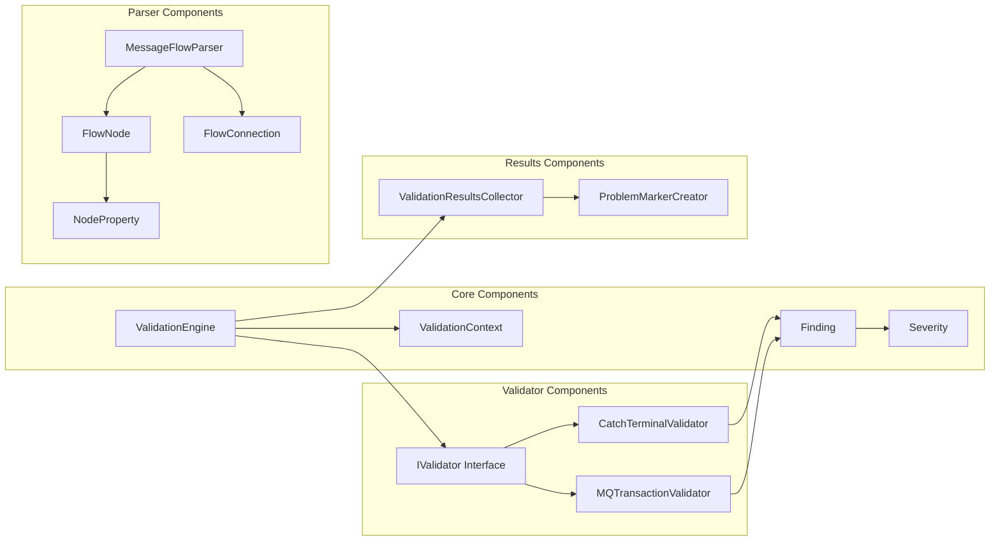

## Data Flow Diagram

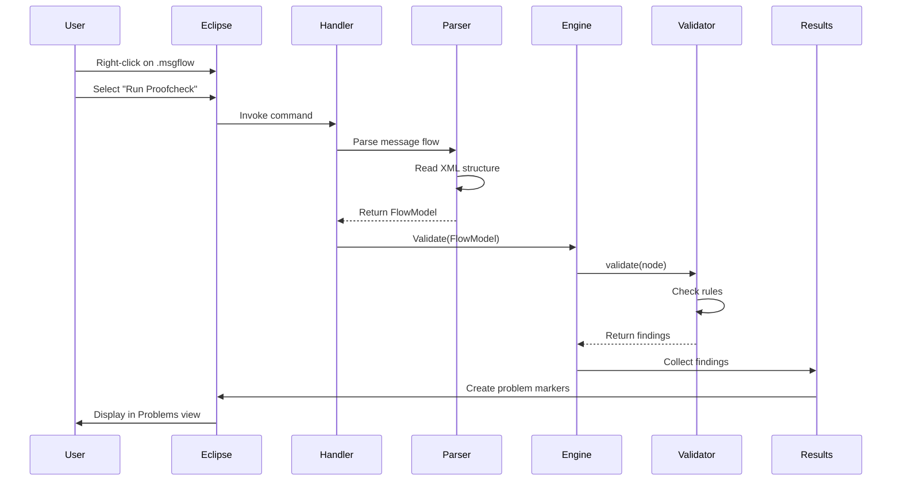

## Class Diagram

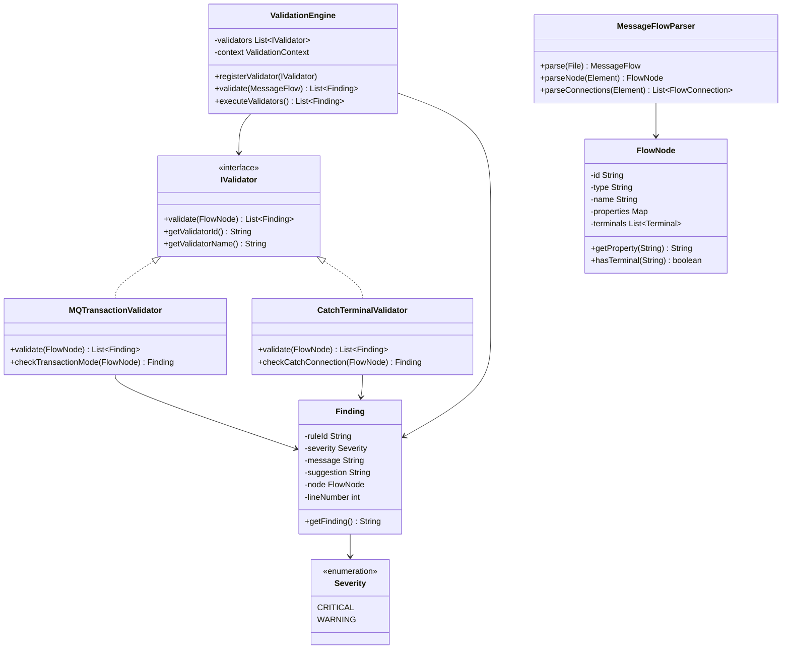

## Validation Flow

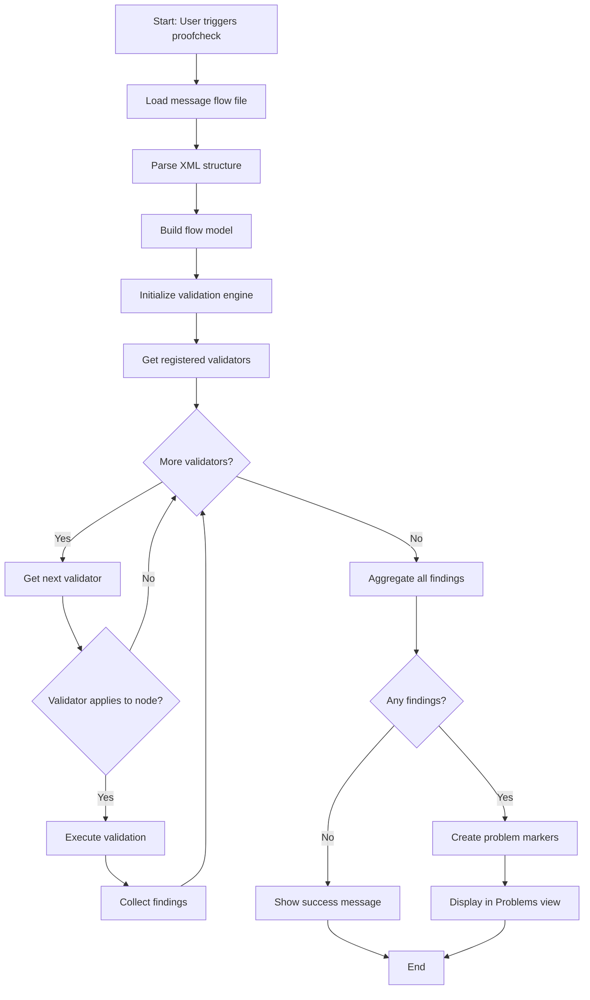

## Plugin Integration Architecture

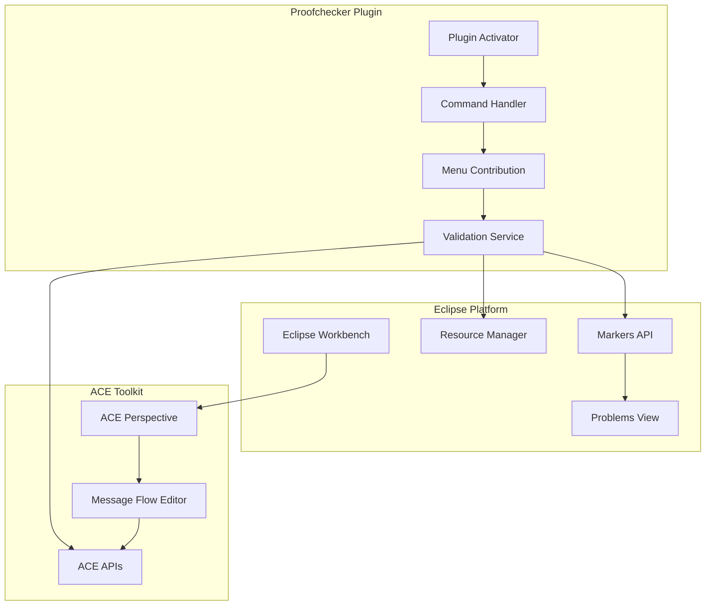

## Validator Extension Architecture

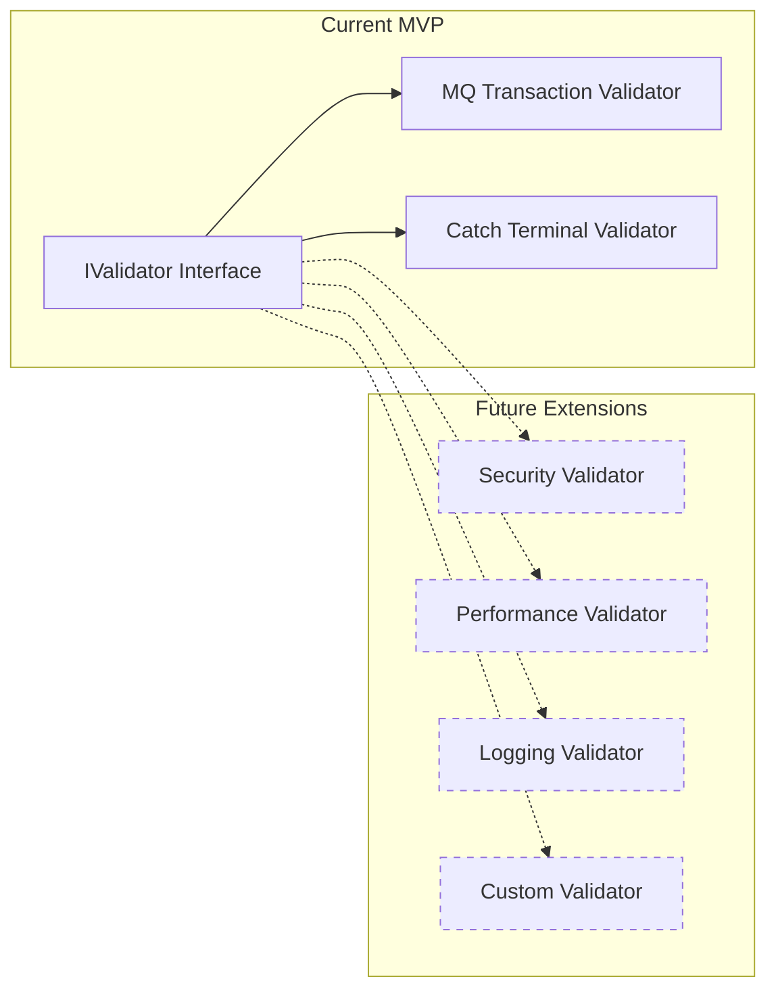

## Design Patterns Used

### 1. Strategy Pattern
- **Purpose**: Encapsulate validation algorithms
- **Implementation**: `IValidator` interface with multiple implementations
- **Benefit**: Easy to add new validators without modifying engine

### 2. Registry Pattern
- **Purpose**: Manage validator instances
- **Implementation**: `RuleRegistry` maintains validator collection
- **Benefit**: Dynamic validator loading and management

### 3. Builder Pattern
- **Purpose**: Construct complex Finding objects
- **Implementation**: `Finding.Builder` class
- **Benefit**: Flexible finding creation with optional parameters

### 4. Observer Pattern
- **Purpose**: Notify UI of validation results
- **Implementation**: Eclipse Markers API
- **Benefit**: Loose coupling between validation and display

## Key Design Decisions

### Decision 1: Eclipse Problems View vs Custom UI
**Choice**: Eclipse Problems View  
**Rationale**: 
- Familiar to developers
- Standard Eclipse integration
- No custom UI maintenance
- Consistent with other tools

### Decision 2: XML Parsing vs ACE API
**Choice**: ACE Toolkit APIs (with XML fallback)  
**Rationale**:
- Official API support
- Better compatibility
- Access to metadata
- Future-proof

### Decision 3: Synchronous vs Asynchronous Validation
**Choice**: Synchronous for MVP  
**Rationale**:
- Simpler implementation
- Adequate for small flows
- Can optimize later
- Easier debugging

### Decision 4: Rule Configuration
**Choice**: Hardcoded for MVP, configurable later  
**Rationale**:
- Faster MVP delivery
- Two rules don't need configuration
- Can add XML/JSON config in Phase 2

## Performance Considerations

### Optimization Strategies
1. **Lazy Loading**: Load validators only when needed
2. **Caching**: Cache parsed flow models
3. **Parallel Validation**: Execute independent validators concurrently (future)
4. **Incremental Validation**: Validate only changed nodes (future)

### Expected Performance
- **Small flows** (<20 nodes): <1 second
- **Medium flows** (20-50 nodes): 1-2 seconds
- **Large flows** (>50 nodes): 2-5 seconds

## Security Considerations

### Data Privacy
- No external network calls
- No data collection or telemetry
- All processing local to IDE

### Code Security
- Input validation on all parsed data
- Safe XML parsing (prevent XXE attacks)
- No dynamic code execution

## Extensibility Points

### 1. New Validators
```java
public class CustomValidator implements IValidator {
    @Override
    public List<Finding> validate(FlowNode node) {
        // Custom validation logic
    }
}
```

### 2. Custom Severity Levels
```java
public enum Severity {
    CRITICAL, WARNING, INFO, SUGGESTION
}
```

### 3. Custom Result Handlers
```java
public interface IResultHandler {
    void handleResults(List<Finding> findings);
}
```

## Testing Architecture

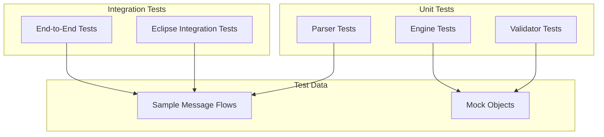

## Deployment Architecture

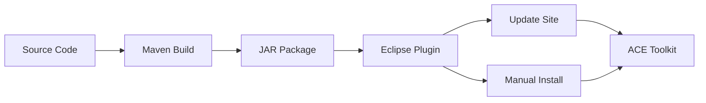

## Future Architecture Enhancements

### Phase 2: Configuration System
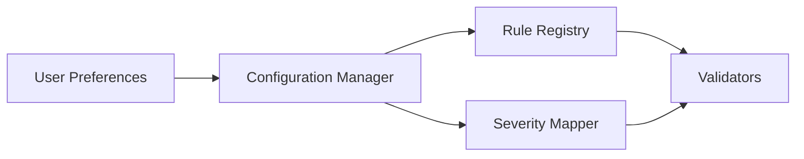

### Phase 3: Quick Fix System


### Phase 4: CI/CD Integration
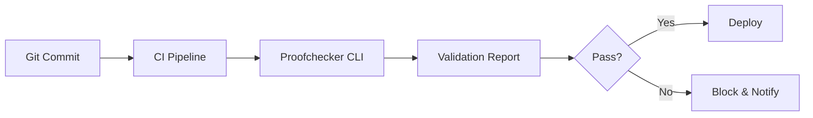

## Conclusion

This architecture provides:
- ✅ Clean separation of concerns
- ✅ Easy extensibility for new validators
- ✅ Standard Eclipse integration
- ✅ Testable components
- ✅ Performance optimization opportunities
- ✅ Clear upgrade path for future features

---

**Document Version**: 1.0  
**Last Updated**: 2026-06-11  
**Status**: Architecture Design Complete