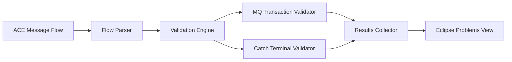

# ACE Toolkit Message Flow Proofchecker - MVP Plan

## Project Information
- **Repository**: https://github.com/Danupriya-Manoharan/SmartACEers-206060
- **Project Name**: SmartACEers Message Flow Proofchecker
- **Version**: 1.0.0-MVP
- **Technology**: Java Eclipse Plugin for IBM ACE Toolkit

## MVP Objective

Create a minimal viable product that validates two critical production scenarios in ACE message flows:
1. **MQ Input Transaction Mode**: Detect when transaction mode is set to "No" (risk of message loss)
2. **Catch Terminal Connection**: Detect when catch terminals are not connected (risk of unhandled errors)

## MVP Scope

### In Scope for MVP
✅ Parse ACE message flow files  
✅ Validate MQ Input node transaction mode configuration  
✅ Validate catch terminal connections  
✅ Display validation results in Eclipse Problems view  
✅ Support Critical and Warning severity levels  
✅ Basic Eclipse plugin integration  
✅ Unit tests for validators  
✅ README with setup instructions  

### Out of Scope for MVP (Future Phases)
❌ Advanced validators (security, performance, logging)  
❌ Custom UI for results display  
❌ Quick-fix actions  
❌ Configurable rules  
❌ Suggestion engine with code snippets  
❌ Integration with CI/CD  
❌ Policy-based validation  

## MVP Architecture

### Component Overview



### Core Components

#### 1. Flow Parser
- **Purpose**: Parse ACE message flow XML files
- **Input**: Message flow file path
- **Output**: Flow model with nodes and connections
- **Key Classes**: `MessageFlowParser`, `FlowNode`, `FlowConnection`

#### 2. Validation Engine
- **Purpose**: Orchestrate validation rule execution
- **Input**: Parsed flow model
- **Output**: List of validation findings
- **Key Classes**: `ValidationEngine`, `ValidationContext`

#### 3. MQ Transaction Validator
- **Purpose**: Check MQ Input node transaction mode
- **Rule**: Flag if transaction mode = "No"
- **Severity**: Critical
- **Key Classes**: `MQTransactionValidator`

#### 4. Catch Terminal Validator
- **Purpose**: Check if catch terminals are connected
- **Rule**: Flag if catch terminal exists but is unconnected
- **Severity**: Critical
- **Key Classes**: `CatchTerminalValidator`

#### 5. Results Collector
- **Purpose**: Aggregate findings and display in Eclipse
- **Output**: Eclipse Problem markers
- **Key Classes**: `ValidationResultsCollector`, `ProblemMarkerCreator`

## MVP Project Structure

```
SmartACEers-206060/
├── README.md
├── MVP-PLAN.md
├── docs/
│   ├── setup-guide.md
│   └── user-guide.md
├── ace-proofchecker-plugin/
│   ├── META-INF/
│   │   └── MANIFEST.MF
│   ├── plugin.xml
│   ├── build.properties
│   ├── src/
│   │   └── com/
│   │       └── smartaceers/
│   │           └── proofchecker/
│   │               ├── core/
│   │               │   ├── ValidationEngine.java
│   │               │   ├── ValidationContext.java
│   │               │   ├── Finding.java
│   │               │   └── Severity.java
│   │               ├── parser/
│   │               │   ├── MessageFlowParser.java
│   │               │   ├── FlowNode.java
│   │               │   └── FlowConnection.java
│   │               ├── validators/
│   │               │   ├── IValidator.java
│   │               │   ├── MQTransactionValidator.java
│   │               │   └── CatchTerminalValidator.java
│   │               ├── results/
│   │               │   ├── ValidationResultsCollector.java
│   │               │   └── ProblemMarkerCreator.java
│   │               └── handlers/
│   │                   └── ProofcheckHandler.java
│   ├── test/
│   │   └── com/
│   │       └── smartaceers/
│   │           └── proofchecker/
│   │               ├── validators/
│   │               │   ├── MQTransactionValidatorTest.java
│   │               │   └── CatchTerminalValidatorTest.java
│   │               └── testdata/
│   │                   ├── sample-flow-valid.msgflow
│   │                   └── sample-flow-invalid.msgflow
│   └── pom.xml (if using Maven)
└── .gitignore
```

## MVP Validation Rules

### Rule 1: MQ Input Transaction Mode

**Rule ID**: `mq.input.transaction.mode`  
**Category**: Message Loss Prevention  
**Severity**: Critical  

**Description**:  
Checks if MQ Input nodes have transaction mode set to "No". When transaction mode is disabled, messages may be lost if processing fails, as there's no automatic rollback mechanism.

**Detection Logic**:
```java
if (node.getType().equals("MQInput")) {
    String transactionMode = node.getProperty("transactionMode");
    if ("No".equalsIgnoreCase(transactionMode)) {
        return new Finding(
            "mq.input.transaction.mode",
            Severity.CRITICAL,
            "MQ Input node has transaction mode set to 'No'. Messages may be lost if processing fails.",
            "Set transaction mode to 'Yes' to ensure message persistence and automatic rollback on failure.",
            node
        );
    }
}
```

**Example Message**:
```
Critical: MQ Input node 'OrderInput' has transaction mode set to 'No'. 
Messages may be lost if processing fails.

Suggestion: Set transaction mode to 'Yes' to ensure message persistence 
and automatic rollback on failure.
```

### Rule 2: Catch Terminal Connection

**Rule ID**: `error.handling.catch.terminal`  
**Category**: Error Handling  
**Severity**: Critical  

**Description**:  
Checks if nodes with catch terminals have them connected. Unconnected catch terminals mean errors are not handled, potentially causing data loss or silent failures.

**Detection Logic**:
```java
if (node.hasCatchTerminal()) {
    boolean isCatchConnected = node.getCatchTerminal().isConnected();
    if (!isCatchConnected) {
        return new Finding(
            "error.handling.catch.terminal",
            Severity.CRITICAL,
            "Node has an unconnected catch terminal. Errors will not be handled.",
            "Connect the catch terminal to an error handling flow or subflow.",
            node
        );
    }
}
```

**Example Message**:
```
Critical: Node 'DatabaseInsert' has an unconnected catch terminal. 
Errors will not be handled.

Suggestion: Connect the catch terminal to an error handling flow or subflow 
to log errors and prevent data loss.
```

## MVP Implementation Plan

### Phase 1: Setup (Week 1)
- [x] Create GitHub repository structure
- [ ] Set up Eclipse plugin project
- [ ] Configure build system (Maven/Gradle)
- [ ] Create basic project skeleton

### Phase 2: Core Framework (Week 2)
- [ ] Implement message flow parser
- [ ] Create validation engine framework
- [ ] Define core interfaces (IValidator, Finding, etc.)
- [ ] Set up Eclipse plugin integration points

### Phase 3: Validators (Week 3)
- [ ] Implement MQ Transaction Mode validator
- [ ] Implement Catch Terminal validator
- [ ] Create unit tests for both validators
- [ ] Test with sample message flows

### Phase 4: Integration (Week 4)
- [ ] Integrate with Eclipse Problems view
- [ ] Add right-click menu action "Run Proofcheck"
- [ ] Implement problem marker creation
- [ ] End-to-end testing

### Phase 5: Documentation & Release (Week 5)
- [ ] Write README with installation instructions
- [ ] Create user guide with examples
- [ ] Document code with Javadoc
- [ ] Create release package
- [ ] Commit to GitHub repository

## Key Interfaces

### IValidator Interface
```java
package com.smartaceers.proofchecker.validators;

import com.smartaceers.proofchecker.core.Finding;
import com.smartaceers.proofchecker.parser.FlowNode;
import java.util.List;

public interface IValidator {
    /**
     * Validates a specific node in the message flow
     * @param node The node to validate
     * @return List of findings (empty if no issues)
     */
    List<Finding> validate(FlowNode node);
    
    /**
     * Gets the unique identifier for this validator
     * @return Validator ID
     */
    String getValidatorId();
    
    /**
     * Gets the human-readable name of this validator
     * @return Validator name
     */
    String getValidatorName();
}
```

### Finding Class
```java
package com.smartaceers.proofchecker.core;

import com.smartaceers.proofchecker.parser.FlowNode;

public class Finding {
    private String ruleId;
    private Severity severity;
    private String message;
    private String suggestion;
    private FlowNode node;
    private int lineNumber;
    
    // Constructor, getters, setters
}
```

### Severity Enum
```java
package com.smartaceers.proofchecker.core;

public enum Severity {
    CRITICAL,  // Must fix - will cause production issues
    WARNING    // Should fix - may cause issues
}
```

## Eclipse Plugin Integration

### plugin.xml Configuration
```xml
<?xml version="1.0" encoding="UTF-8"?>
<?eclipse version="3.4"?>
<plugin>
   <extension point="org.eclipse.ui.commands">
      <command
            id="com.smartaceers.proofchecker.runProofcheck"
            name="Run Proofcheck">
      </command>
   </extension>
   
   <extension point="org.eclipse.ui.handlers">
      <handler
            commandId="com.smartaceers.proofchecker.runProofcheck"
            class="com.smartaceers.proofchecker.handlers.ProofcheckHandler">
      </handler>
   </extension>
   
   <extension point="org.eclipse.ui.menus">
      <menuContribution
            locationURI="popup:org.eclipse.ui.popup.any?after=additions">
         <command
               commandId="com.smartaceers.proofchecker.runProofcheck"
               label="Run Proofcheck"
               style="push">
            <visibleWhen checkEnabled="false">
               <with variable="selection">
                  <iterate ifEmpty="false">
                     <adapt type="org.eclipse.core.resources.IFile">
                        <test property="org.eclipse.core.resources.extension"
                              value="msgflow">
                        </test>
                     </adapt>
                  </iterate>
               </with>
            </visibleWhen>
         </command>
      </menuContribution>
   </extension>
</plugin>
```

## Testing Strategy

### Unit Tests
- Test each validator independently
- Mock message flow nodes
- Verify correct findings are generated
- Test edge cases (null values, missing properties)

### Integration Tests
- Test with real ACE message flow files
- Verify Eclipse integration works
- Test problem marker creation
- Validate end-to-end workflow

### Test Data
Create sample message flows:
1. `sample-flow-valid.msgflow` - No issues
2. `sample-flow-invalid.msgflow` - Contains both issues
3. `sample-flow-mq-only.msgflow` - Only MQ transaction issue
4. `sample-flow-catch-only.msgflow` - Only catch terminal issue

## Success Criteria for MVP

✅ Plugin successfully installs in ACE Toolkit  
✅ Right-click menu shows "Run Proofcheck" option  
✅ Correctly identifies MQ transaction mode issues  
✅ Correctly identifies unconnected catch terminals  
✅ Results appear in Eclipse Problems view  
✅ No false positives on valid flows  
✅ All unit tests pass  
✅ Documentation is clear and complete  

## Future Enhancements (Post-MVP)

### Phase 2: Extended Validation
- Add failure terminal validation
- Add transaction boundary checks
- Add basic logging validation
- Add configurable severity levels

### Phase 3: User Experience
- Custom results view with grouping
- Quick-fix actions for common issues
- Batch validation for multiple flows
- Configuration UI for enabling/disabling rules

### Phase 4: Advanced Features
- Security validators (credentials, SSL)
- Performance validators (timeouts, pooling)
- Custom rule definition framework
- Integration with CI/CD pipelines

### Phase 5: Intelligence
- Learn from production incidents
- Suggest best practices based on flow patterns
- Performance profiling and optimization suggestions
- Compliance checking against organizational standards

## Dependencies

### Required
- Eclipse Plugin Development Environment (PDE)
- IBM ACE Toolkit v12.x or higher
- Java 11 or higher
- JUnit 5 for testing

### Optional
- Maven or Gradle for build automation
- SLF4J for logging
- Mockito for mocking in tests

## Risk Mitigation

### Risk: ACE API Changes
**Mitigation**: Use stable ACE APIs, version-specific adapters if needed

### Risk: Performance Issues
**Mitigation**: Keep MVP simple, optimize in later phases

### Risk: False Positives
**Mitigation**: Extensive testing with real-world flows, user feedback loop

### Risk: Low Adoption
**Mitigation**: Focus on high-value rules, clear messaging, easy installation

## Timeline

- **Week 1**: Setup and project structure
- **Week 2**: Core framework implementation
- **Week 3**: Validator implementation and testing
- **Week 4**: Eclipse integration and end-to-end testing
- **Week 5**: Documentation and release

**Total Duration**: 5 weeks for MVP

## Next Steps

1. Review and approve this MVP plan
2. Set up development environment
3. Clone repository and create project structure
4. Begin Phase 1 implementation
5. Regular check-ins and progress updates

---

**Document Version**: 1.0  
**Last Updated**: 2026-06-11  
**Status**: Ready for Review